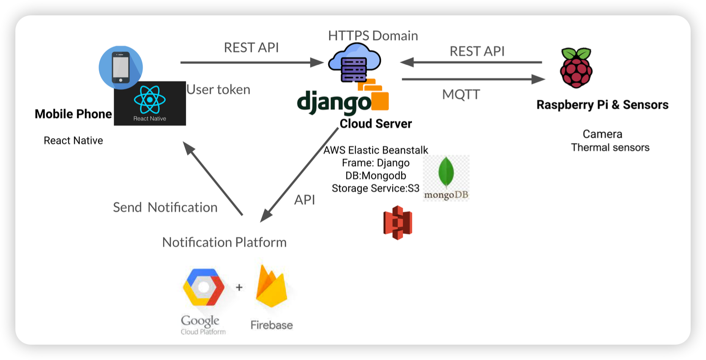

# WatchDog-Epsilon

## Introduction
The Watch Dog system, developed to enhance pa- tient safety in healthcare for elderly patients with Alzheimer’s and other cognitive impairments, integrates sensor technology with digital communication tools. This system, comprising a mobile app, AWS-powered cloud server, and Raspberry Pi units, uses RESTful APIs, Google Cloud Server, Firebase services, and MQTT for communication. Testing showed the system’s effective functionality, with good accuracy and responsiveness. However, challenges in door exit detection, such as tracking errors and detection latency, were identified, alongside the influence of background environments on object detection accuracy. These findings highlight areas for future enhancement in the system.

## Main Features
- [x] Door Exit Detection
- [x] Fall Detection
- [x] Bed Exit Detection
- [x] Easy bluetooth pairing setup
- [x] Remote control of the sensors

## Architecture Diagram
